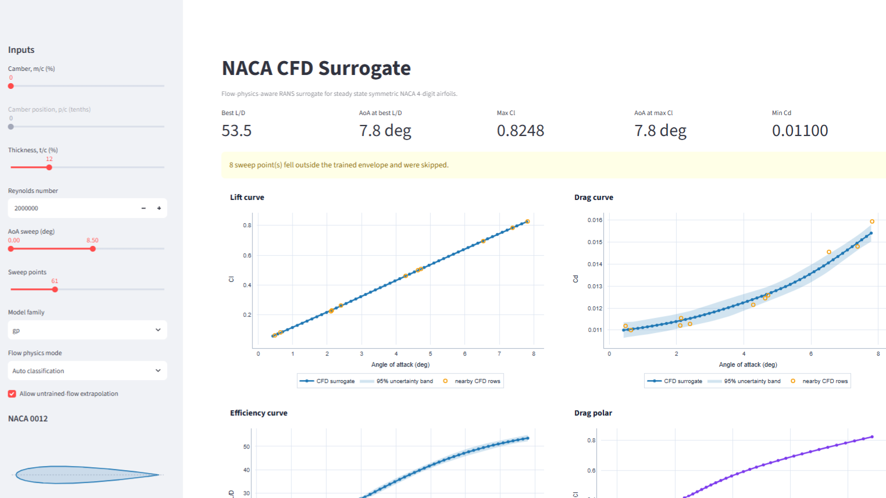

<h1 align="center">CamberLab</h1>

<p align="center">
  <strong>A flow-physics-aware CFD surrogate for NACA 4-digit aerofoils</strong>
</p>

<p align="center">
  <a href="#license"></a>
  
  
  
  
</p>

---

CamberLab replaces minutes-to-hours of OpenFOAM RANS simulation with millisecond
surrogate evaluation:

```text
(angle of attack, Reynolds number, thickness, flow physics) → (Cl, Cd, L/D)
```

The core idea is that **one CFD recipe cannot cover the whole design space**.
Attached turbulent flow, near-stall separation, transitional low-Reynolds flow,
and fully turbulent high-Reynolds flow are governed by different physics and need
different turbulence models, wall treatments, y+ targets, and meshes. CamberLab
partitions the design space into four flow-physics ranges, validates a dedicated
CFD template for each, then merges the samples into one dataset with the
flow-physics class as an explicit surrogate input.

Every prediction the app makes is labelled with the confidence the underlying CFD
data actually supports — trained and validated, trained but unvalidated, or
extrapolated.

## Screenshots

<!-- Replace the two placeholders below with real screenshots of the running app.
     Suggested captures:
       1. docs/images/app-overview.png  — full dashboard: sidebar inputs, aerofoil
          preview, flow-physics status banner, Cl/Cd curves
       2. docs/images/app-polar.png     — drag polar / L-D view with uncertainty
          bands and training-point overlay
     Recommended: 1600px wide PNG, light theme, browser chrome cropped out. -->

|  |  |
|---|---|
|  |
| *Dashboard: geometry preview, flow-physics classification, and Cl/Cd vs α* |

## Features

- **Regime-aware CFD pipeline** — four OpenFOAM 12 templates (Spalart–Allmaras,
  k-ω SST, k-kL-ω), each with its own mesh strategy and y+ target.
- **Reference-validated setups** — per-regime probes against Abbott & von
  Doenhoff, NASA Turbulence Modeling Resource, Ladson, and XFOIL data before any
  regime contributes training samples.
- **Four surrogate families** — Gaussian Process, Random Forest, MLP, and Kriging
  (SMT), each fitted for both Cl and Cd, with per-regime metrics reported
  alongside global ones.
- **Honest uncertainty** — GP/Kriging variance where available, plus explicit
  banners for unvalidated or untrained regions rather than silent extrapolation.
- **Interactive Streamlit app** — α sweeps, drag polars, L/D, NACA 4-digit
  geometry preview, model-family switching, and CFD training points overlaid on
  the surrogate curves.
- **Artifact-only inference** — the app and CLI read committed `models/` and
  `results/` artifacts; raw OpenFOAM case directories are never required.
- **Reproducible by construction** — `random_state = 42` everywhere, DOE and
  train/test indices frozen at generation time and never rewritten.

## Quickstart

### Run the app (no OpenFOAM needed)

Prediction only requires the Python environment — the trained models are
committed.

```bash
git clone https://github.com/saifrehman945/CamberLab.git
cd CamberLab

micromamba env create -f environment.yml
micromamba run -n openfoam streamlit run app.py
```

The dashboard opens at <http://localhost:8501>.

> Prefer conda/mamba? `conda env create -f environment.yml` works too. The
> environment is named `openfoam` because the same environment drives the CFD
> pipeline; OpenFOAM itself is *not* installed by it.

### Predict from the command line

```bash
micromamba run -n openfoam python scripts/predict.py \
  --alpha 4.0 --re 2.0e6 --thickness 0.12 --family gp
# gp: Cl=0.43103  Cd=0.01225
```

Useful flags: `--family {gp,rf,mlp,krg,all}` to pick a model family, and
`--regime {A,B,C,D}` to assert a flow-physics range instead of using the
classifier. See [Project status](#project-status) before relying on `krg` or
`mlp`.

### Run the CFD pipeline (Linux + OpenFOAM 12)

Regenerating the dataset additionally needs a system-level
[OpenFOAM 12](https://openfoam.org) (Foundation release) and GNU `parallel`:

```bash
source /opt/openfoam12/etc/bashrc

micromamba activate openfoam
python scripts/01_doe.py               # 175-point per-regime LHS → samples.csv
python scripts/02_geometry.py          # analytic NACA 4-digit coordinates
python scripts/03_mesh.py              # gmsh structured C+H mesh per regime
python scripts/04_run_cfd.py           # render template + foamRun (GNU parallel)
python scripts/07_harvest_results.py   # convergence gate → results/dataset_clean.csv
python scripts/08_validation.py        # per-regime validation vs reference data
python scripts/09_train_surrogates.py  # GP / RF / MLP / KRG → models/
python scripts/10_global_validation.py # test-set metrics, parity, Sobol, OOD
```

This project targets the OpenFOAM **Foundation** fork, where `simpleFoam` is
superseded by `foamRun -solver incompressibleFluid`. ESI (openfoam.com) syntax is
not supported.

## Project status

CamberLab is a **research preview**. The 175-point DOE is fully defined, but not
every flow-physics range has finished CFD and training. `results/dataset_clean.csv`,
`results/surrogate_metrics.csv`, and `models/regime_bounds.json` are the source of
truth for what the persisted surrogate actually supports.

| Flow physics | Dataset rows | Status |
|---|---:|---|
| Attached turbulent (A) | 75 | Trained and validated |
| Near-stall separated (B) | 0 | Not trained — app marks queries as extrapolation |
| Transitional low-Re (C) | 8 | Trained, **unvalidated** (low confidence) |
| High-Re attached (D) | 40 | Trained and validated |

Test-set R² on the 25 held-out samples (Gaussian Process, the strongest family):

| Slice | Cl R² | Cd R² |
|---|---:|---:|
| Attached turbulent (A) | 0.9999 | 0.979 |
| High-Re attached (D) | 0.9986 | 0.981 |
| Transitional low-Re (C) | 0.633 | 0.323 |
| Global | 0.944 | 0.425 |

Known limitations, stated plainly:

- **Symmetric aerofoils only.** Camber can be previewed in the app but is
  unsupported; predictions fall back to the symmetric NACA 00xx model at the
  selected thickness.
- **No stall.** With zero near-stall samples, anything at α ≥ 10° is
  extrapolation and is flagged as such.
- **Regime C is not locked.** Its NACA0012 probes miss the XFOIL reference by
  ~15% on Cl and ~39% on Cd, well outside the ≤5% / ≤10% acceptance bars. Its
  eight rows are included but marked low-confidence; the low global Cd R² above
  is dominated by them.
- **MLP Cd is unusable** (negative R² across all slices). It is kept in the
  repository for comparison, not for use. Prefer GP for Cd.
- **The committed Kriging artifacts do not load under SMT ≥ 2.13** — unpickling
  raises `AttributeError: 'PowExp' object has no attribute 'theta'`. This also
  breaks `predict.py --family all` (the CLI default), so pass an explicit
  `--family gp|rf|mlp` until the models are retrained against a pinned SMT
  version. `environment.yml` currently pins only `smt>=2.3.0`.
- Missing ranges should be filled by harvesting real CFD into
  `results/dataset_clean.csv` and retraining — never by fabricating rows.

## How it works

### Flow regimes

| ID | Name | α (°) | Re | t/c | Turbulence | Wall treatment | Target y+ | Cells |
|---|---|---|---|---|---|---|---|---|
| A | Attached turbulent | 0–8 | 1.5×10⁶ – 3×10⁶ | 0.10–0.18 | Spalart–Allmaras | Wall functions | 20–50 | 80k–200k |
| B | Near-stall separated | 10–16 | 1×10⁶ – 3×10⁶ | 0.12–0.24 | k-ω SST | Fully resolved | < 1 | 300k–1M |
| C | Transitional low-Re | 0–8 | 3×10⁵ – 1×10⁶ | 0.08–0.15 | k-kL-ω (transition) | Fully resolved | < 1 | 500k–1.2M |
| D | High-Re attached | 0–6 | 2×10⁶ – 5×10⁶ | 0.10–0.18 | Spalart–Allmaras | Wall functions | 30–80 | 50k–150k |

Chord = 1.0 m, ν = 1.5×10⁻⁵ m²/s. Angle of attack is imposed by rotating the
inlet velocity vector (and the `forceCoeffs` lift/drag directions) — never by
rotating the mesh. The global query envelope is α ∈ [0°, 16°],
Re ∈ [5×10⁵, 5×10⁶], t/c ∈ [0.08, 0.24].

At inference time an arbitrary `(α, Re, t)` point is labelled by a
first-match-wins priority rule (`scripts/mesh/regime_parameters.py`): α ≥ 10° → B;
Re < 1×10⁶ → C; Re ≥ 2×10⁶ with α ≤ 6° and 0.10 ≤ t/c ≤ 0.18 → D; otherwise A.

### Design of experiments

Latin hypercube sampling runs independently inside each regime's bounding box
(`pyDOE2`, `criterion='maximin'`), then the samples are concatenated. The 80/20
split is stratified by regime so every regime appears in both halves.

| Regime | N | Train | Test |
|---|---:|---:|---:|
| A | 80 | 64 | 16 |
| B | 25 | 20 | 5 |
| C | 30 | 24 | 6 |
| D | 40 | 32 | 8 |
| **Total** | **175** | **140** | **35** |

The indices in `train_idx.npy` / `test_idx.npy` are frozen: test samples are
never trained on, never used for hyperparameter selection, and never used to
decide which CFD to re-run.

### Surrogate models

One global model per output, per family:

```text
X = [α_deg, Re, thickness, regime_A, regime_B, regime_C, regime_D]  →  Cl, Cd
```

Continuous features are standardized; the regime is one-hot encoded across four
columns so no false ordinal relation is imposed on a categorical variable.

| Family | Configuration |
|---|---|
| Gaussian Process | `sklearn`, `Matern(ν=2.5) + WhiteKernel`, `n_restarts_optimizer=10`, `normalize_y=True` |
| Random Forest | `sklearn`, `n_estimators=200` |
| MLP | `sklearn`, layers `(64, 64, 32)`, ReLU, `early_stopping=True` |
| Kriging | `smt.surrogate_models.KRG` |

Acceptance bar: per-regime R² ≥ 0.90 for Cl and ≥ 0.85 for Cd. Global R² alone is
reported but treated as misleading, since sample-rich regimes dominate it.

### CFD validation

A regime contributes training samples only after its NACA0012 probes agree with
canonical references within |ΔCl| ≤ 5% and |ΔCd| ≤ 10%, with qualitative Cp
agreement.

| Regime | Probe points | Reference |
|---|---|---|
| A | Re = 2×10⁶, α ∈ {0, 4, 8}; Re = 3×10⁶, α = 4 | Abbott & von Doenhoff; NASA TMR (SA) |
| B | Re = 2×10⁶, α ∈ {12, 14, 16} | NASA TMR; AGARD experimental |
| C | Re = 5×10⁵, α ∈ {2, 4, 6} | XFOIL with eᴺ transition; low-Re experiment |
| D | Re = 4×10⁶, α ∈ {0, 4} | NASA TMR (SA) |

Reference datasets live in `validation_data/` with a provenance manifest; results
land in `validation/`.

## Repository layout

```text
CamberLab/
├── app.py                      # Streamlit dashboard (artifact-only)
├── environment.yml             # micromamba/conda environment
├── samples.csv                 # 175 × [case_id, alpha_deg, Re, thickness, regime]
├── train_idx.npy, test_idx.npy # frozen stratified split
│
├── scripts/
│   ├── 01_doe.py               # per-regime LHS → samples.csv
│   ├── 02_geometry.py          # analytic NACA 4-digit → aerofoil.dat
│   ├── 03_mesh.py              # gmsh structured C+H mesh, regime-specific
│   ├── 04_run_cfd.py           # render template + foamRun via GNU parallel
│   ├── 07_harvest_results.py   # forceCoeffs parsing + convergence gate
│   ├── 08_validation.py        # per-regime reference validation
│   ├── 09_train_surrogates.py  # GP / RF / MLP / KRG
│   ├── 10_global_validation.py # test-set metrics, parity, Sobol, OOD
│   ├── 11_sweep_curves.py      # α sweeps through the trained surrogate
│   ├── predict.py              # CLI over the inference layer
│   ├── mesh/                   # meshing package (topology, BL, wake, quality)
│   ├── surrogate/              # inference, data loading, regime bounds
│   └── validation/             # reference parsing, comparison, reporting
│
├── openfoam_template/          # one OpenFOAM 12 case template per regime
│   └── regime_{A,B,C,D}/       # 0/, constant/momentumTransport, system/
│
├── validation_data/            # published reference data + provenance manifest
├── validation/                 # validation reports, mesh quality, summaries
├── models/                     # preprocessor + {gp,rf,mlp,krg}_{Cl,Cd}.joblib
├── results/                    # dataset_clean.csv, surrogate_metrics.csv, plots
├── docs/images/                # app screenshots
└── cases/                      # generated OpenFOAM cases (gitignored, ~GB)
```

`cases/` is deliberately untracked: meshes, fields, and logs are large and fully
regenerable from `scripts/` + `openfoam_template/` + `samples.csv`.

## Roadmap

- [ ] Lock Regime C — resolve the transitional Cl/Cd discrepancy vs XFOIL
- [ ] Run and lock Regime B, giving the surrogate real near-stall support
- [ ] Complete the full 175-case dataset and retrain
- [ ] Extend to cambered NACA 4-digit sections (nonzero `m`, `p`)
- [ ] Add Cp(x/c) as a surrogate output alongside the integrated coefficients
- [ ] Pin SMT and retrain the Kriging artifacts so `--family all` works again
- [ ] Continuous-integration smoke test for the app and inference layer

## Contributing

Issues and pull requests are welcome. Before opening a PR, please read
[`CLAUDE.md`](CLAUDE.md) — it is the development guide for this repo and covers
the non-obvious constraints. The essentials:

- Work inside the `openfoam` micromamba environment; never system Python or bare `pip`.
- Never guess OpenFOAM dictionary syntax. Verify against `$FOAM_TUTORIALS`,
  `foamInfo <keyword>`, and `foamSearch`. OpenFOAM 12 uses
  `constant/momentumTransport`, not `turbulenceProperties`.
- Keep the templates per-regime; never reuse one regime's template for another.
- Use `pathlib.Path` relative to `PROJECT_ROOT`, the `logging` module rather than
  `print()`, `joblib` rather than `pickle`, and seed 42 for anything stochastic.
- Do not touch the frozen test indices, and do not add dataset rows that did not
  come from a converged, validated CFD run.

Design rationale in depth: [`README_complete.md`](README_complete.md).

## License

Released under the MIT License. See [`LICENSE`](LICENSE).
