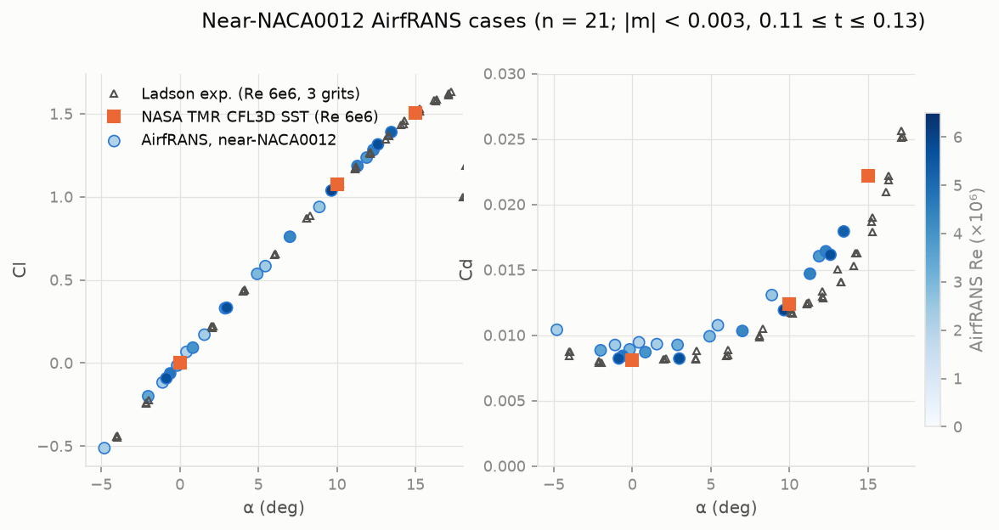

# CamberLab on AirfRANS — final report

Branch `airfrans-surrogate`, phases 1–9, 2026-09-27. Nothing has been pushed.

## 1. What was built

CamberLab's retired four-regime OpenFOAM dataset (archived in `legacy/regime_v1/`)
was replaced by AirfRANS (Bonnet et al., NeurIPS 2022), read locally from
`PLAID-datasets/AirfRANS_remeshed`. Each of the 1,000 samples becomes one row
of `results/airfrans_dataset.csv`. A row holds α, U∞, Re, four section-geometry
features recovered from the CFD mesh wall (`t_max`, `x_tmax`, `m_max`, `x_m`),
and the stored C_L and C_D. The rows are QA-checked without being edited, and
split with the official AirfRANS task memberships. On those splits we fit four
scalar coefficient surrogates (GP, RF, MLP, SMT Kriging) for Cl and log Cd,
per task. The models are then benchmarked against the paper's field models
with the paper's own metrics. A new inference API, `predict(α, Re, naca,
family, task)`, generates analytic NACA 4/5-digit sections and passes them
through the same feature extractor used at ingestion. It powers
`scripts/predict.py`, `scripts/11_sweep_curves.py` and a rewritten Streamlit
app. All gates (1, 2, 3, 4, 6, 8) passed, and `uv run pytest` runs 84 tests
green.

## 2. Data findings (Gate 2) and QA (Gate 4)

**Gate 2** (`results/airfrans_inspection.md`):

- Scalars per sample: `angle_of_attack` (**radians**; −0.0862 to 0.2605,
  i.e. −4.94° to 14.93°), `inlet_velocity` (m/s; 31.28 to 93.59), `C_L`, `C_D`.
  Fields: `implicit_distance`, `nut`, `p`, `Ux`, `Uy` (nodal) and `zone_0..5`
  (cell). One unstructured triangular zone per sample, with 4,203–9,711 nodes.
- There are 1,000 samples and no original simulation name, so `sample_id` =
  row index. The card's split lists index those same rows.
- Re = U∞·c/ν with ν(298.15 K) = 1.5498×10⁻⁵ m²/s (AirfRANS' polynomial) gives
  Re from 2.02×10⁶ to 6.04×10⁶. AirfRANS' own nominal values are ~0.6% lower:
  both the dataset limits and the `reynolds` split edges imply
  ν ≈ 1.56×10⁻⁵. This is a constant factor with no effect on models.
- The mesh carries no boundary tags. The aerofoil wall is recovered
  topologically, as the boundary loop off the clip box: a single closed loop
  of 473–1,670 nodes per sample, all within |implicit_distance| ≤ 3.2×10⁻⁴.
  Selecting nodes with |d| < 10⁻⁶ alone would miss about half the wall.
- **Surprise:** the samples only deserialise with `pyplaid==0.1.7`. Versions
  0.1.8+ and 1.0 reject the serialised schema; `plaid` and `plaid-lib` on PyPI
  are unrelated packages, and `plaid-lib==100.100.100` looks like a squatted
  name.

**Gate 4** (`results/airfrans_qa.md`, flags in `results/airfrans_qa_flags.csv`):

- **Hard checks: 0 of 1,000 rows fail.** No non-finite values, no Cd outside
  (0, 0.3), no |Cl| ≥ 2.5, no duplicates. No rows were excluded from any split.
- Lift slope of near-symmetric sections (|α| ≤ 8°, n = 138): 0.1058 /deg,
  inside the expected 0.09–0.12.
- The zero-lift angle is negative for 100% of the 549 cambered sections, and
  grows more negative with camber down to about −8°.
- Leave-one-out GP outliers (|z| > 5): **10 rows listed, none dropped**:
  samples 37, 99, 166, 300, 367, 374, 460, 626, 700, 800. Eight are Cd
  outliers, all thin sections (t/c 0.05–0.08) at negative α, mostly cambered.
  Two of them (99, 300; Cd 0.035 and 0.046) show the high drag of lower-surface
  leading-edge separation, and the rest are attached neighbours of that cliff.
  They are physically plausible, so they stay. Samples 374 and 700 are mild Cl
  outliers (|z| ≈ 5.1–5.5) at high camber.

## 3. Reference comparison: Ladson and NASA TMR

21 near-NACA0012 cases (|m_max| < 0.003, 0.11 ≤ t/c ≤ 0.13) span α −4.8° to
13.5° and Re 2.0–6.0×10⁶. Figure: `results/figures/qa/reference_naca0012.png`.

- **Ladson** (NASA TM 4074, Re 6×10⁶, tripped; mean of three grit zones):
  median |ΔCl| = 0.009. Median ΔCd/Cd = +15.5%. The Cd excess falls steadily
  with Re: +14% to +26% for cases at Re 2.0–2.5×10⁶, and +2% to +5% at
  Re 5.7–6.0×10⁶. This is the expected Reynolds effect against a 6×10⁶
  experiment, not a data defect.
- **NASA TMR CFL3D SST** (Re 6×10⁶): three cases lie within ±0.5° of a TMR
  angle. Mean |ΔCl| = 0.009 (TMR Cl interpolated to each case's α); mean
  |ΔCd| = 8.7×10⁻⁴ (10% of the reference Cd). The one case at matching Re
  (sample 997: Re 6.03×10⁶, α 9.66°, t/c 0.1175) agrees to ΔCl = −0.003 and
  ΔCd = −3.6%.

## 4. Benchmark vs the paper

**Comparability.** Our splits are the official AirfRANS memberships from the
dataset card, and QA excluded nothing, so **every test set is identical to
the paper's**. Two differences remain: ours are single deterministic fits
(seed 42), while the paper averages 5 trained copies; and the paper's field
models ingest the full flow mesh, while ours use six scalars.

**Paper numbers.** The primary comparison uses the corrected results: arXiv
2212.07564 v3, Appendix N, Table 27. This follows the authors' 26 May 2023
disclaimer that the main-text models had been trained with plain MSE by
mistake. We verified that the repo's `score_WMSE.json` equals Table 27 value
for value, and that `score_MSE.json` equals main-text Tables 3 and 5. The
original numbers are shown in brackets in `results/airfrans_benchmark.md`.
The metric is `rel_err = |(true − pred)/true|` (`metrics.py:44`), a raw
ratio; below it is expressed as a percentage.

| Task | Our best ρ_D | Paper's best ρ_D | Our best ρ_L | Paper's best ρ_L | Our best mean rel. err. C_D | Paper's best | Our best mean rel. err. C_L | Paper's best |
|---|---|---|---|---|---|---|---|---|
| `full` | 0.992 (MLP) | 0.250 (MLP) | 0.9995 (GP) | 0.996 (GraphSAGE) | 1.5% (KRG) | 618% (MLP) | 4.3% (KRG) | 14.8% (GraphSAGE) |
| `scarce` | 0.990 (MLP) | 0.254 (GraphSAGE) | 0.9991 (GP) | 0.996 (GraphSAGE) | 3.2% (MLP) | 454% (MLP) | 5.3% (GP) | 15.0% (GraphSAGE) |
| `reynolds` | 0.962 (MLP) | 0.192 (Graph U-Net) | 0.9994 (GP) | 0.981 (PointNet) | 6.2% (RF) | 829% (MLP) | 5.1% (GP) | 38.4% (PointNet) |
| `aoa` | 0.964 (KRG) | 0.552 (Graph U-Net) | 0.9983 (GP) | 0.989 (GraphSAGE) | 2.1% (GP) | 435% (MLP) | 6.9% (GP) | 25.4% (GraphSAGE) |

Every one of our 16 model/task combinations has ρ_D ≥ 0.74 (≥ 0.91 excluding
the GP on `reynolds`), against a paper-wide best of 0.55. Our mean relative Cd
error is 1.5–16%, against 435–1,810% for the field models. On lift, the field
models rank well (ρ_L 0.96–0.996), but their magnitudes are 3–7× less
accurate than ours.

**Reporting targets for `full`** (Cl R² ≥ 0.99, Cd R² ≥ 0.95, ρ_D ≥ 0.9):
met by GP (0.9992 / 0.9768 / 0.978), KRG (0.9992 / 0.9881 / 0.987) and MLP
(0.9984 / 0.9771 / 0.992). RF misses by a hair on Cd R² (0.9498).

**GP calibration** (share of test points inside ±2σ; the nominal rate is
95.4%): `full` 0.95 (Cl) / 0.965 (Cd); `scarce` 0.94 / 0.925; `reynolds`
0.93 / 0.96; `aoa` 0.94 / 0.90. The bands are well calibrated in
interpolation and slightly overconfident under extrapolation.

## 5. Best family per task, and failure modes

| Task | Recommended | Why |
|---|---|---|
| `full` | **KRG** (GP a close second) | Best Cd R² (0.988) and Cd error (1.5% mean, 0.66% median) with Cl R² 0.9992; KRG and GP also give calibrated σ. MLP ranks drag best (ρ_D 0.992) but is 2–3× less accurate in magnitude. |
| `scarce` (200 rows) | **MLP** for Cd, **GP** for Cl | With few rows, GP/KRG Cd degrade (R² 0.89/0.94), while the CV-tuned MLP holds Cd R² 0.957, ρ_D 0.990. GP Cl stays at R² 0.9986. |
| `reynolds` | **MLP** or **RF** for Cd, **GP/KRG** for Cl | See failure mode 1 below. Cl extrapolates in Re almost perfectly with every smooth model (GP R² 0.9989). |
| `aoa` | **GP** or **KRG** | They extrapolate the stall-side trend: for α > 12.5°, Cl MAE ≈ 0.015–0.018 and Cd median error ≈ 1.3–1.8%. |

Failure modes:

1. **GP/KRG Cd extrapolation to lower Re (`reynolds`).** GP Cd R² is 0.22
   (KRG 0.71), even though the median error is 5.4%. A handful of thin (t/c
   0.05–0.06) sections at negative α below Re 3×10⁶ are overpredicted 3–5.9×
   (sample 166: CFD 0.0083, GP 0.0489). In log-Cd space the GP learned a steep
   separation cliff from the high-drag separated cases at Re 3–5×10⁶ (the QA
   outliers 99 and 300 are of that kind), and it projects the cliff onto
   attached cases it has never seen at lower Re. GP Cd is also biased about
   −20% across the whole Re < 3×10⁶ side: it misses the rise of skin friction
   as Re drops. Above 5×10⁶ the same GP extrapolates well (median 2.4%). RF
   and MLP have no such tails (worst errors ~70%).
2. **RF cannot extrapolate (`aoa`).** Its piecewise-constant predictions
   flatten beyond the training α: for α > 12.5° the Cl bias is −0.136 and the
   Cd bias −16%. Its mean relative Cl error, 83%, is inflated further by
   Cl ≈ 0 cases at negative α.
3. **Thin cambered sections at negative α** are the hardest corner for every
   family and task (lower-surface separation). The worst Cd error on `aoa`
   test is ~81–83% for all families, on this kind of case.
4. **Mean relative Cl error is unstable** near Cl = 0 for every model (for
   example GP on `full`: mean 4.5% vs median 1.1%). Read the median.

The tests were evaluated once. No model or hyperparameter was changed after
seeing test results.

## 6. Open issues and suggested next steps

- **Deploy weight.** `requirements.txt` now includes `datasets`, `pyarrow` and
  `pyplaid==0.1.7`, which the app never imports. For the live Streamlit demo,
  consider splitting them into a `requirements-ingest.txt`. The demo's new
  models would also add ~53 MB (`models/full/`) to the repository.
- **Committed models:** only `models/full/` is committed. The `scarce`,
  `reynolds` and `aoa` model sets (~100 MB) are gitignored and regenerated
  with `scripts/09_train_surrogates.py --task all` (~20 min).
- **Stale screenshot:** `docs/images/app-overview.png` shows the retired
  regime UI and is no longer referenced from the README. Capture a new one.
- **Low-Re drag extrapolation:** if extrapolation in Re matters, add
  physics-informed structure to the Cd model. For example, fit a residual on
  top of a flat-plate skin-friction baseline ∝ Re^(−1/5), or use a Re-monotone
  kernel, so drag can't fall with decreasing Re. An ensemble of GP and MLP on
  Cd is a cheap mitigation.
- **Features:** `x_tmax` barely varies (0.290–0.303; every NACA 4/5-digit
  section peaks near 30% chord), and the GPs drive its length scale to the
  bound. It is harmless but could be dropped. `m_max` is measured from the
  geometric chord and reads 3–23% below nominal NACA camber for cambered
  sections. This is consistent between training and inference, but should be
  kept in mind when reading it.
- **Seeds:** our numbers are single fits; repeating with 5 seeds would give
  the ± spreads the paper reports.
- **Next models:** `results/airfrans_surfaces.npz` already holds 101-point
  upper/lower surfaces per sample, ready for a shape-based (PCA/CST) model or
  a Cp(x) surrogate from the stored pressure fields.
- **Legacy code** under `legacy/regime_v1/` is archived as-is. Its imports
  assume the old layout, and it is not tested.
