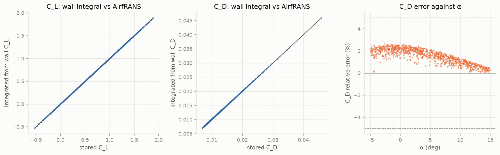
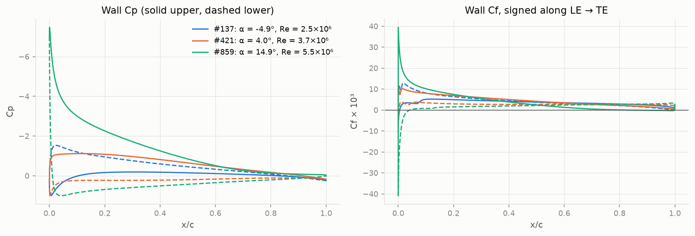

# Wall Cp / Cf feasibility gate

C_L and C_D re-integrated from the extracted wall pressure and computed wall shear stress (AirfRANS' `Compute_coefficients`, ported in `scripts/airfrans/surface.py`), compared with the stored coefficients over all 1000 samples.

Pass rule (D4): median relative error ≤ limit, and at most 5% of samples above 3 × limit. Limits: C_L 2%, C_D 5%.

| check | median rel. | mean rel. | 95th pct rel. | median abs. | share above tail limit | pass |
|---|---|---|---|---|---|---|
| Cl_pressure_only | 0.02% | 0.04% | 0.17% | 1.18e-04 | 0.0% (> 6%) | yes |
| Cl | 0.00% | 0.00% | 0.00% | 3.27e-06 | 0.0% (> 6%) | yes |
| Cd | 1.66% | 1.55% | 2.41% | 1.71e-04 | 0.0% (> 15%) | yes |

Median share of C_D carried by the wall shear stress: 68%.

**Cp: PASS. Cf: PASS.**

The mean relative C_L error is inflated by samples with C_L near zero; the median and the absolute error are the meaningful figures.

## Worst 10 samples by C_D error (listed, not dropped)

| sample_id | alpha_deg | Re | t_max | m_max | Cl | Cl_int | Cd | Cd_int | rel_Cd |
|---|---|---|---|---|---|---|---|---|---|
| 987 | -2.561 | 5.963e+06 | 0.1768 | 0.02132 | -0.03404 | -0.03404 | 0.00921 | 0.009455 | 0.02654 |
| 770 | -2.113 | 5.063e+06 | 0.1434 | 0.02917 | 0.03237 | 0.03237 | 0.008817 | 0.009046 | 0.02598 |
| 975 | -1.557 | 5.917e+06 | 0.1294 | 0.03758 | 0.1524 | 0.1524 | 0.008421 | 0.00864 | 0.02597 |
| 897 | -1.263 | 5.611e+06 | 0.1564 | 0.006437 | -0.07151 | -0.07151 | 0.00879 | 0.009018 | 0.02594 |
| 970 | 0.464 | 5.893e+06 | 0.148 | 0.0004829 | 0.05552 | 0.05552 | 0.008524 | 0.008744 | 0.02578 |
| 981 | 0.643 | 5.946e+06 | 0.1361 | 0.008615 | 0.1669 | 0.1669 | 0.008338 | 0.00855 | 0.02552 |
| 921 | -0.293 | 5.689e+06 | 0.1855 | 0.01797 | 0.1638 | 0.1638 | 0.009522 | 0.009765 | 0.02549 |
| 919 | -0.854 | 5.681e+06 | 0.1289 | 9.503e-05 | -0.09203 | -0.09203 | 0.008217 | 0.008426 | 0.02548 |
| 684 | -2.09 | 4.749e+06 | 0.147 | 0.01434 | -0.08779 | -0.08778 | 0.008892 | 0.009117 | 0.02532 |
| 691 | -1.295 | 4.773e+06 | 0.1614 | 0.01264 | -0.01622 | -0.01622 | 0.009155 | 0.009386 | 0.02526 |

## Figures

